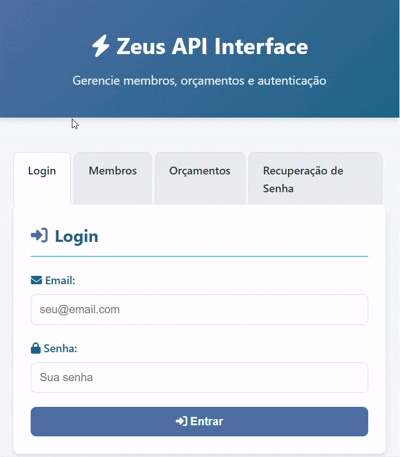

# ⚡ Projeto Zeus

## 🎥 Demonstração da Interface Visual
Veja abaixo uma demonstração da interface visual da API:



## 📚 Descrição do produto

O Projeto Zeus é um sistema backend desenvolvido para gerenciar membros, clientes, projetos, orçamentos, penalidades e equipamentos. Ele oferece uma API robusta e escalável, construída com **Node.js** e **TypeScript**, utilizando **PostgreSQL** como banco de dados. O sistema conta com autenticação JWT, integração com serviços de e-mail, suporte a múltiplos papéis de usuário (administradores, membros e estagiários) e funcionalidades como check-in/check-out de equipamentos e histórico de alterações em orçamentos.

## 💻 Tecnologias utilizadas

- **Node.js** 18
- **TypeScript** 5.2
- **Express** 4.18
- **TypeORM** 0.3
- **PostgreSQL** 14
- **Nodemailer** 6.10
- **Docker** 3.8
- **Jest** 29.6 (para testes)
- **Insomnia** (para testes manuais de API)

## 🧑‍💻 Regras de código adotadas

- Uso do padrão **camelCase** para variáveis e funções.
- Funções devem seguir o princípio da **Single Responsibility**.
- Limitação de 25 linhas por função.
- Comentários explicativos obrigatórios para cada função.
- Aplicação do princípio **DRY** (Don't Repeat Yourself).
- Tratamento de erros padronizado em toda a aplicação.

## 🧑‍💻 Regras e padrões de Git adotadas

- Commits devem seguir o padrão de commits semânticos, conforme [esta documentação](https://github.com/iuricode/padroes-de-commits).
- A branch `main` deve conter o código mais estável.
- A branch `back` deve conter o código mais atualizado.
- Para cada nova funcionalidade ou correção, deve ser criada uma branch de trabalho com a seguinte nomenclatura:
  - **feature/**: Para novas funcionalidades.  
    Exemplo: `feature/rota-login`.
  - **bugfix/**: Para correções de bugs.  
    Exemplo: `bugfix/corrigir-login`.
  - **hotfix/**: Para correções urgentes em produção.  
    Exemplo: `hotfix/corrigir-token`.
  - **refactor/**: Para refatoração de código.  
    Exemplo: `refactor/refatorar-autenticacao`.
- Após concluir as alterações, deve ser criado um Pull Request para a branch `back`.
- A cada 2 dias, a branch `back` deve ser mergeada na `main`, garantindo que o código esteja funcional e consistente.

## 🧑‍💻 Como rodar o projeto

1. Clone o repositório:
   ```bash
   git clone https://github.com/torrescf/Projeto-Zeus.git
   cd Projeto-Zeus
   ```
2. Instale as dependências:
   ```bash
   npm install
   ```
3. Configure o arquivo `.env` com as variáveis de ambiente necessárias.
4. Inicie o banco de dados PostgreSQL e rode as migrations:
   ```bash
   npm run migration:run
   ```
5. Inicie o servidor em modo de desenvolvimento:
   ```bash
   npm run dev
   ```
6. Teste os endpoints utilizando o Insomnia ou outro cliente REST.

## 🔐 Arquivo .env

As seguintes variáveis de ambiente são necessárias para o funcionamento do sistema:

```env
DB_HOST= host do seu banco de dados
DB_PORT= porta do seu banco de dados 
DB_USER= Seu usuário do banco de dados
DB_PASSWORD= Sua senha do banco de dados
DB_NAME= nome do banco de dados
JWT_SECRET= sua chave secreta
EMAIL_USER= seu email
EMAIL_PASS= sua senha
```

## 📁 Estrutura de pastas

```
├── src
│   ├── config/               # Configurações do banco de dados e ambiente
│   ├── controllers/          # Controladores das rotas
│   ├── entities/             # Entidades do banco de dados (TypeORM)
│   ├── middlewares/          # Middlewares de autenticação e validação
│   ├── routes/               # Definição das rotas da API
│   ├── services/             # Lógica de negócio
│   ├── tests/                # Testes automatizados
│   ├── index.ts              # Ponto de entrada da aplicação
├── public/                   # Arquivos estáticos (ex.: interface visual)
├── .env                      # Variáveis de ambiente
├── package.json              # Dependências e scripts do projeto
├── tsconfig.json             # Configuração do TypeScript
└── README.md                 # Documentação do projeto
```

## Justificativa do Banco de Dados

Optei por utilizar o **PostgreSQL**, um banco de dados relacional, devido às seguintes razões:

1. **Consistência e Integridade**: O PostgreSQL oferece suporte robusto a transações ACID, garantindo a consistência dos dados.
2. **Relacionamentos Complexos**: O sistema requer relacionamentos entre entidades como membros, projetos, clientes e orçamentos, que são bem suportados por bancos relacionais.
3. **Escalabilidade**: O PostgreSQL é altamente escalável, suportando grandes volumes de dados e consultas complexas.
4. **Comunidade e Suporte**: Possui uma ampla comunidade e documentação, facilitando a resolução de problemas e a implementação de novas funcionalidades.

## Exemplos de Uso da API

### 1. Cadastro de Membros
**Endpoint**: `POST /member`  
**Exemplo de Requisição**:
```json
{
  "name": "John Doe",
  "email": "john.doe@compjunior.com.br",
  "role": "member",
  "phone": "123456789",
  "gender": "male",
  "skills": ["JavaScript", "TypeScript"]
}
```
**Resposta**:
```json
{
  "id": 1,
  "name": "John Doe",
  "email": "john.doe@compjunior.com.br",
  "role": "member",
  "phone": "123456789",
  "gender": "male",
  "skills": ["JavaScript", "TypeScript"]
}
```

---

### 2. Gerenciamento de Penalidades
**Endpoint**: `POST /penalty`  
**Exemplo de Requisição**:
```json
{
  "type": "warning",
  "reason": "Atraso no projeto",
  "date": "2023-10-01",
  "memberId": 1
}
```
**Resposta**:
```json
{
  "id": 1,
  "type": "warning",
  "reason": "Atraso no projeto",
  "date": "2023-10-01",
  "member": {
    "id": 1,
    "name": "John Doe"
  }
}
```

---

### 3. Check-in/Check-out de Equipamentos
**Check-out**  
**Endpoint**: `PUT /equipment/:id/check-out`  
**Exemplo de Requisição**:
```json
{
  "memberId": 1
}
```
**Resposta**:
```json
{
  "id": 1,
  "name": "Laptop",
  "checkedOutBy": {
    "id": 1,
    "name": "John Doe"
  }
}
```

**Check-in**  
**Endpoint**: `PUT /equipment/:id/check-in`  
**Resposta**:
```json
{
  "id": 1,
  "name": "Laptop",
  "checkedOutBy": null
}
```

---

### 4. Gerenciamento de Projetos
**Endpoint**: `POST /project`  
**Exemplo de Requisição**:
```json
{
  "name": "Novo Projeto",
  "description": "Descrição do projeto",
  "status": "planning",
  "leaderId": 1,
  "budgetId": 1
}
```
**Resposta**:
```json
{
  "id": 1,
  "name": "Novo Projeto",
  "description": "Descrição do projeto",
  "status": "planning",
  "leader": {
    "id": 1,
    "name": "John Doe"
  },
  "budget": {
    "id": 1,
    "title": "Orçamento Inicial"
  }
}
```

---

### 5. Recuperação de Senha
**Endpoint**: `POST /auth/reset-password/:token`  
**Exemplo de Requisição**:
```json
{
  "password": "newpassword123"
}
```
**Exemplo de Resposta**:
```json
{
  "message": "Password reset successfully"
}
```

## ✍🏻 Autor

| [<br><sub>João Pedro Oliveira</sub>](https://github.com/torrescf) |
| :---: |
